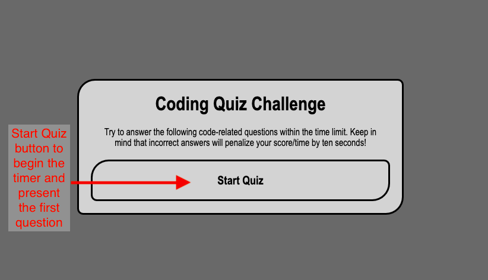
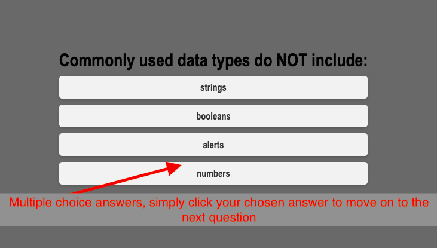
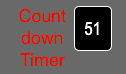
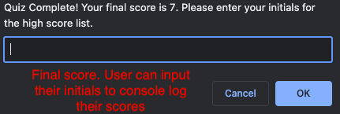

# module-four-challenge
Coding Bootcamp Module Four Challenge

## Description

The goal of this project was to create a coding quiz challenge as a fun way to review coding material and knowledge. 

## Installation

N/A

## Usage

The usage of this quiz is to provide users with a fun challenge to help review coding concepts. The user clicks the start button which generates one question after another. A timer runs in the upper right corner, which is the users final score. For each question answered wrong the user will have 10 seconds subtracted from the timeclock. The goal is to answer the questions as quickly as possible, avoiding wrong answers, to achieve the highest score. High scores can then be console logged at the end with the users initials.  

## Credits

Referenced the following link for countdown timer: src=".https://stackoverflow.com/questions/20618355/how-to-write-a-countdown-timer-in-javascript"

## License

Please refer to the license in the repo
